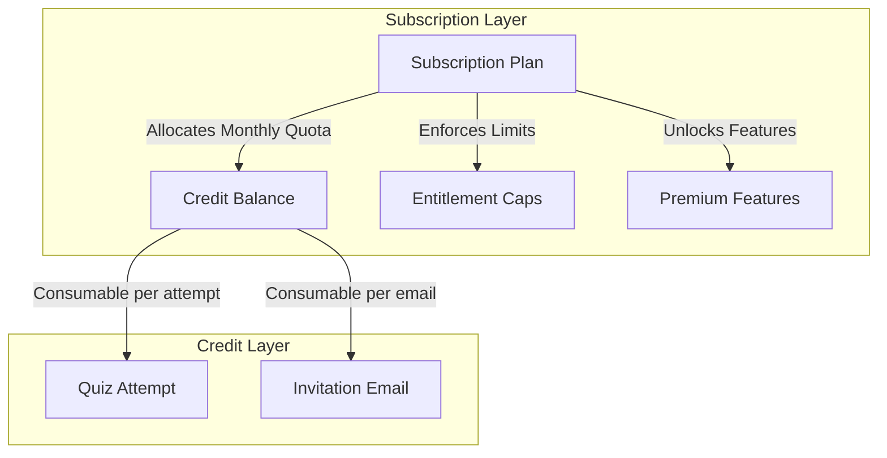

# ExamAssess Subscription & Credit System Design Specification

This document details the architectural blueprint for introducing a subscription-based tier system that layers seamlessly on top of ExamAssess’s existing credit-based model. It provides separate subscription paths for **Individual Students** and **Teachers**, using professional SaaS nomenclature and pricing structures.

---

## 1. Core Architectural Strategy

Rather than replacing the existing credit-based architecture, the subscription system acts as a **membership controller and credit multiplier**. 



### Key Integration Principles:
1. **Recurring Monthly Quotas**: Subscriptions automatically grant a recurring allotment of credits at the beginning of each billing cycle.
2. **Feature Gatekeeping**: Advanced configurations, analytical reports, and proctoring models are restricted based on the subscription tier.
3. **Credit Rollover**: Unused credits from subscription allowances do not roll over (preventing credit hoarding), whereas manually purchased "Top-Up Packs" do not expire.
4. **Top-Up Discounts**: Higher-tier subscriptions grant a percentage discount on additional credit pack purchases.

---

## 2. Student Subscription Framework

Designed for individual learners preparing for added exams, certifications, or custom practice tests.

### Plan Tiers & Specifications

| Plan Name | Professional Alias | Price / Month | Monthly Credits | Key Features Unlocked | Features / Limits |
| :--- | :--- | :--- | :--- | :--- | :--- |
| **Free** | **Starter Learner** | $0.00 | **15 Credits** | • Basic practice tests<br>• Public mock exams | • Max 1 classroom enrollment<br>• Mistake Book capped at last 10 errors<br>• Ad-supported UI |
| **Premium** | **Prep Pro** | $9.99 | **150 Credits** | • Pro Practice Timer custom settings<br>• Full Mistake Book & Bookmark Practice<br>• Detailed AI Explanations | • Max 5 classroom enrollments<br>• Ad-free UI<br>• 15% discount on top-up credits |
| **Advanced** | **Achiever Elite** | $19.99 | **500 Credits** | • Unlimited Practice Mock tests<br>• Interactive topic diagnostic dashboard<br>• PDF Report generation | • Unlimited classroom enrollments<br>• Priority customer support<br>• 30% discount on top-up credits |

### How Student Credits are Consumed:
- **Practice Tests**: Consumes credits dynamically based on the category's config cost (e.g., 2 credits per attempt).
- **Teacher-Scheduled Exams**: Free to take for the student, as the cost is covered by the scheduling Teacher's credits.

---

## 3. Teacher Subscription Framework

Designed for educators, tutoring institutions, and academic departments to schedule assessments, run live proctoring, and manage student cohorts.

### Plan Tiers & Specifications

| Plan Name | Professional Alias | Price / Month | Base Monthly Credits | Entitlement Limits | Premium Features Unlocked |
| :--- | :--- | :--- | :--- | :--- | :--- |
| **Free** | **Educator Lite** | $0.00 | **50 Assessment Credits**<br>**50 Email Credits** | • Max 2 Classrooms<br>• Max 30 Students per class<br>• 200 MCQ Bank Size cap<br>• 5 Scheduled Exams/month | • Basic MCQ Bank Management<br>• Strict Randomization settings only<br>• Manual grading/results release |
| **Premium** | **Instructional Pro** | $29.99 | **1,500 Assessment Credits**<br>**2,500 Email Credits** | • Max 10 Classrooms<br>• Max 150 Students per class<br>• 2,000 MCQ Bank Size cap<br>• 50 Scheduled Exams/month | • **Secure & Strict Exam Modes** (Browser lock detection, proctor console)<br>• Bulk upload from CSV/Excel<br>• Auto-release result policies<br>• CSV exports of gradebooks |
| **Advanced** | **Academic Enterprise** | $79.99 | **Unlimited Assessment Credits**<br>**Unlimited Email Credits** | • **Unlimited Classrooms**<br>• **Unlimited Students**<br>• **Unlimited MCQ Bank Size**<br>• **Unlimited Scheduled Exams** | • Cohort Performance Heatmaps<br>• Departmental/Multi-teacher MCQ sharing<br>• White-label custom domains & branding<br>• Google Classroom & LMS API integration |

---

## 4. Technical Database Schema Extensions (MongoDB)

To implement this model without breaking existing logic, the following schemas are introduced:

### 1. Subscription Schema (`models/Subscription.ts`)
```typescript
import mongoose, { Schema } from 'mongoose';

const SubscriptionSchema = new Schema({
  name: { type: String, required: true }, // e.g. "Prep Pro"
  tier: { type: String, enum: ['starter', 'pro', 'enterprise'], required: true },
  role: { type: String, enum: ['student', 'teacher'], required: true },
  priceMonthly: { type: Number, required: true },
  priceYearly: { type: Number, required: true },
  creditsAllotment: {
    assessmentCredits: { type: Number, default: 0 },
    emailCredits: { type: Number, default: 0 }
  },
  limits: {
    classrooms: { type: Number, default: 1 },
    studentsPerClass: { type: Number, default: 30 },
    mcqBankSize: { type: Number, default: 200 },
    scheduledExamsPerMonth: { type: Number, default: 5 }
  },
  features: {
    aiExplanations: { type: Boolean, default: false },
    secureExamMode: { type: Boolean, default: false },
    proctorDashboard: { type: Boolean, default: false },
    whiteLabeling: { type: Boolean, default: false }
  }
});
```

### 2. User & Teacher Document Extensions
```typescript
// Append to User/Teacher collections
subscription: {
  planId: { type: Schema.Types.ObjectId, ref: 'Subscription' },
  status: { type: String, enum: ['active', 'canceled', 'past_due', 'trialing'], default: 'active' },
  billingCycle: { type: String, enum: ['monthly', 'yearly'], default: 'monthly' },
  currentPeriodStart: { type: Date, default: Date.now },
  currentPeriodEnd: { type: Date },
  cancelAtPeriodEnd: { type: Boolean, default: false }
}
```

---

## 5. Middleware Enforcement Flow

An Express middleware validates subscription allowances on CRUD endpoints.

```typescript
import { Request, Response, NextFunction } from 'express';

export const checkTeacherSubscriptionLimit = (limitField: 'classrooms' | 'mcqBankSize' | 'scheduledExamsPerMonth') => {
  return async (req: Request, res: Response, next: NextFunction) => {
    try {
      const teacher = req.user; // populated from auth token
      const subscription = await Subscription.findById(teacher.subscription.planId);
      
      if (!subscription) {
        return res.status(403).json({ message: "Subscription plan not active." });
      }

      const limit = subscription.limits[limitField];
      
      // Calculate current usage
      let currentUsage = 0;
      if (limitField === 'classrooms') {
        currentUsage = await Classroom.countDocuments({ teacherId: teacher._id });
      } else if (limitField === 'mcqBankSize') {
        currentUsage = await MCQ.countDocuments({ teacherId: teacher._id });
      }

      if (currentUsage >= limit) {
        return res.status(402).json({
          message: `Subscription limit reached. Your current plan allows a maximum of ${limit} ${limitField}.`,
          code: "LIMIT_EXCEEDED",
          upgradeRequired: true
        });
      }

      next();
    } catch (err) {
      res.status(500).json({ message: "Internal server error during subscription check." });
    }
  };
};
```

---

## 6. Front-End Feature Locking Strategy

React components check the active subscription and render premium tools with locked states.

```tsx
import React from 'react';
import { useAuth } from '../../context/AuthContext';

export const SecureExamModeToggle: React.FC = () => {
  const { user } = useAuth();
  const hasAccess = user?.subscription?.features?.secureExamMode;

  return (
    <div className={`form-group ${!hasAccess ? 'opacity-50 pointer-events-none' : ''}`}>
      <div className="flex justify-between items-center">
        <label className="form-label">Secure Exam Mode (Proctoring)</label>
        {!hasAccess && (
          <span className="badge badge-accent badge-sm cursor-pointer" onClick={triggerUpgradeModal}>
            Upgrade to Pro
          </span>
        )}
      </div>
      <select disabled={!hasAccess} className="form-select">
        <option value="none">Standard Browser</option>
        <option value="strict">Webcam Proctoring + Tab Lock</option>
      </select>
    </div>
  );
};
```

---

## 7. Migration Plan

For existing users:
1. **Existing Students**: Automatically grandfathered into the **Starter Learner** tier with their current credit balances intact.
2. **Existing Teachers**: Migrated onto the **Educator Lite** tier. If their current count of classrooms/students exceeds the free plan limit, they are granted a 30-day grace period to upgrade or align with the limits before editing is frozen.
